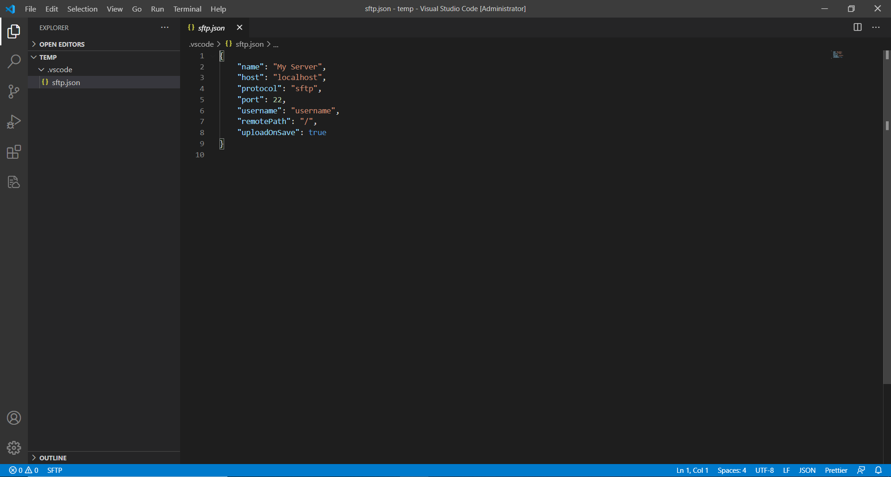
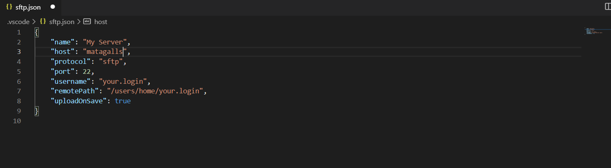
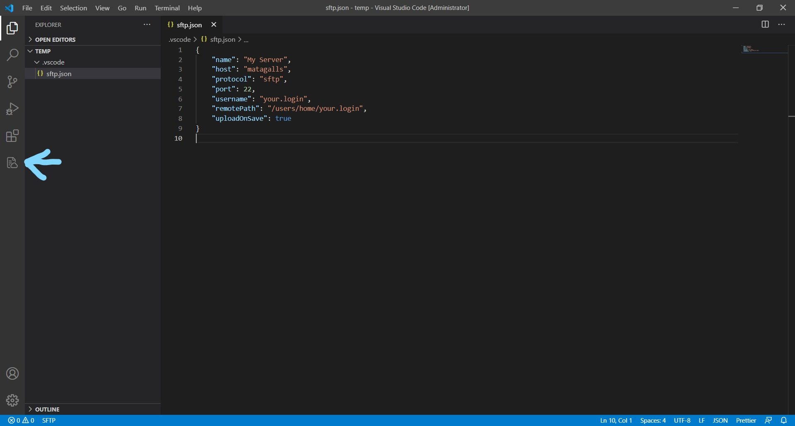

# How to connect Visual Studio Code with a SFTP (La Salle)

In this repo I will explain how I use the SFTP extension on VSCode to help me code faster and upload the files easier and without using VIM.

### **CONSIDER GIVING A STAR TO THE REPO :)**

**IMPORTANT:** I am considering that anyone that do the following steps has already installed, setup and has the GlobalProtect connected to the server. 

## How to install Visual Studio Code?
First of all, we will need to download Visual Studio Code (VSCode).
### Windows and MacOS
<https://code.visualstudio.com/download>

### Linux (Ubuntu)
We will need to update and upgrade the packages.
```
sudo apt update
sudo apt upgrade
```
Then we will run this command that will install the VSCode.
```
sudo apt install code
```

## Install the SFTP extension in VSCode
To install the SFTP extension we will search "SFTP" in the extensions search engine as shown:
### 1-


### 2- 
 


Or by entering the following link:
<https://marketplace.visualstudio.com/items?itemName=liximomo.sftp>

## Setting up the SFTP extension

### Opening a New File
We will open a new file by doing:
<kbd>Ctrl</kbd> + <kbd>N</kbd>
or
<kbd>Command</kbd> + <kbd>N</kbd>
or by going:
File > New File

### Setup
Once we have the new file opened, we must press:

<kbd>Ctrl</kbd> + <kbd>Shift</kbd> + <kbd>P</kbd>
or
<kbd>Command</kbd> + <kbd>Shift</kbd> + <kbd>P</kbd>

This should appear:
 


We will search "sftp" and click on the following option:
 


In the bottom-right part of the window it will appear the following **Notification**
 


We will have to select a folder where the files will be saved (You can create, for example, a **Folder** called **TempFiles** in the **Documents**  and select that file).

Once the folder is selected, we will repeat the process we did before:

<kbd>Ctrl</kbd> + <kbd>Shift</kbd> + <kbd>P</kbd>
or
<kbd>Command</kbd> + <kbd>Shift</kbd> + <kbd>P</kbd>

This should appear:
 


We will search "sftp" and click on the following option:
 


A **.json** file will open.
 


If we are planning to connect to **La Salle Server** we will put the following information. **IMPORTANT!** instead of "your.login" you will have to put your EStudy login.
 


When we are done, we press:
<kbd>Ctrl</kbd> + <kbd>S</kbd> or <kbd>Command</kbd> + <kbd>S</kbd> to save the Config file. 

At that moment a new Icon will appear at the left-hand side, we will click in it. 
 


Once we clicket we will click on "My Server" and it will ask us for the password (it is the same as the EStudy). When we finish putting the password all the files will show up. 

To edit one file we will right click in it and select "Edit in local" we will change the file and when we save the file (using <kbd>Ctrl</kbd> + <kbd>S</kbd> or <kbd>Command</kbd> + <kbd>S</kbd>) it will automatically be uploaded to the server.  


