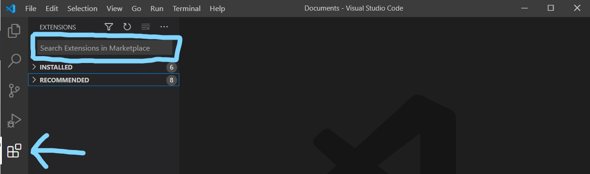
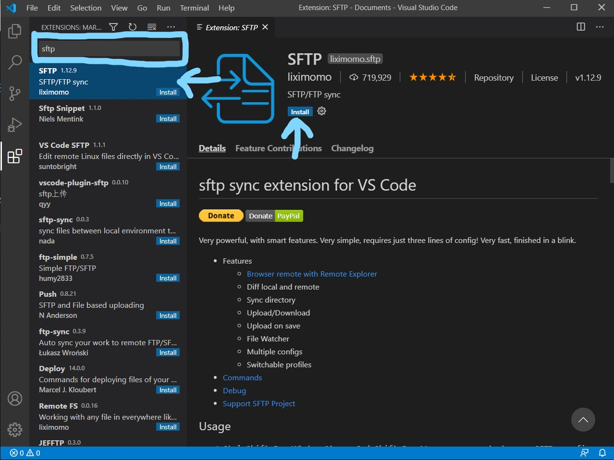
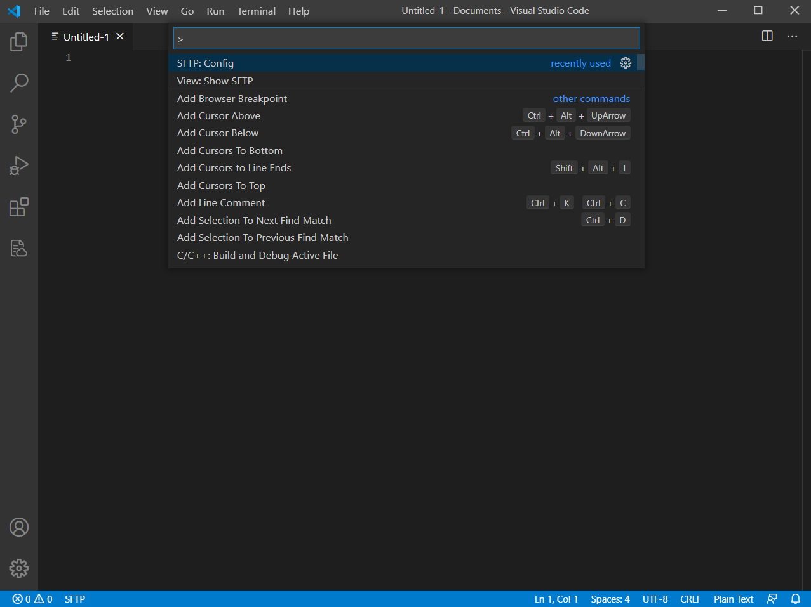
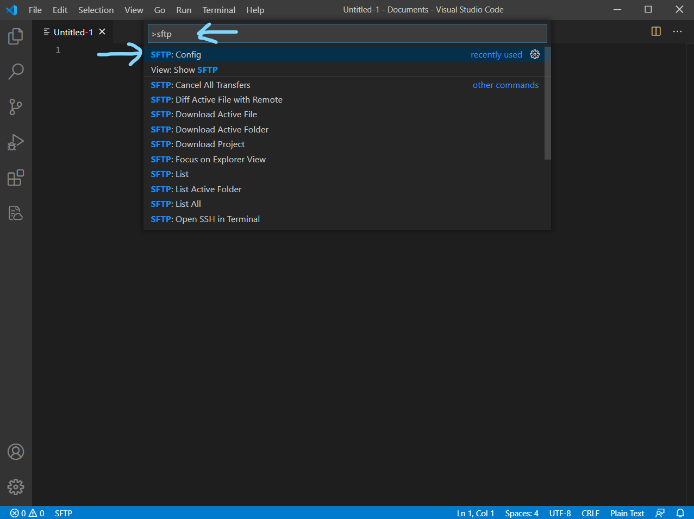
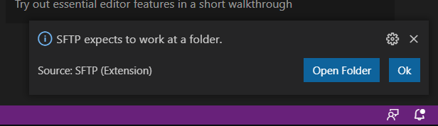

# How to connect Visual Studio Code with a SFTP (La Salle)


## How to install Visual Studio Code?
First of all we will need to download Visual Studio Code (VSCode).
### Windows and MacOS
<https://code.visualstudio.com/download>

### Linux (Ubuntu)
We will need to update and upgrade the packages.
```
sudo apt update
sudo apt upgrade
```
Then we will run this command that will install the VSCode.
```
sudo apt install code
```

## Install the SFTP extension in VSCode
To install the SFTP extension we will search "SFTP" in the extensions search engine as shown:
### 1-


### 2- 
 

Or by entering the following link:
<https://marketplace.visualstudio.com/items?itemName=liximomo.sftp>

## Setting up the SFTP extension

### Opening a New File
We will open a new file by doing:
<kbd>Ctrl</kbd> + <kbd>N</kbd>
or
<kbd>Command</kbd> + <kbd>N</kbd>
or by going:
File > New File

### SetUp
Once we have the new file oppened we must press:
<kbd>Ctrl</kbd> + <kbd>Shift</kbd> + <kbd>P</kbd>
or
<kbd>Command</kbd> + <kbd>Shift</kbd> + <kbd>P</kbd>

This should appear:
 

We will search "sftp" and click on the following option:
 

In the bottom-right part of the window it will appear the following **Notification**
 
We will have to select a folder where the files will be saved (You can create, for example, a **Folder** called **TempFiles** in the **Documents**  and select that file).

Once the folder is selected...


